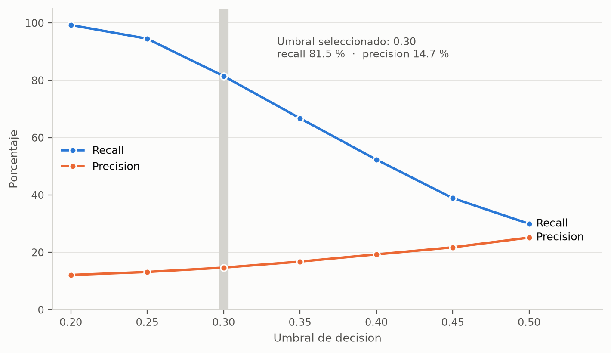

# Entrega 2 — Reporte

**Micro-proyecto · Desarrollo de Soluciones · MAIA — Universidad de los Andes**
Camilo Andres Rodriguez Duenas · Jasbyn Rainier Solano Carrillo ·
Leonardo Almanza Sanchez · Gineth Katerine Arias Carrillo

> **Restriccion del enunciado: maximo 10 paginas.** Si se entrega mas, solo se
> califican las primeras 10. El reporte de trabajo en equipo va aparte y tiene
> su propio limite de 1 pagina.
>
> Presupuesto sugerido: seccion 1 = 1 pagina (tope del enunciado), seccion 2 =
> 4 paginas, seccion 3 = 2 paginas, seccion 4 = 2 paginas, deja 1 de holgura.
>
> Este archivo es el borrador de trabajo. La version que se entrega se exporta
> a documento con el formato del curso.

---

## 1. Resumen del problema

*(maximo 1 pagina — tope del enunciado. Version de trabajo: Leonardo la
ajusta antes de la entrega.)*

### Contexto del problema

El reingreso hospitalario temprano, entendido como una nueva hospitalizacion
dentro de los 30 dias posteriores al alta, representa una utilizacion repetida
de servicios en un periodo corto y una oportunidad de fortalecer el seguimiento
tras el egreso. Cuando la institucion dispone de capacidad limitada para
llamadas o controles posteriores, la priorizacion suele depender del criterio
clinico individual y de las condiciones operativas del alta, sin que la
capacidad se asigne necesariamente primero a los pacientes de mayor riesgo. El
prototipo aborda ese vacio: no reemplaza el criterio clinico, sino que ordena
la lista de egresos del dia segun una estimacion comparable de riesgo.

### Pregunta de negocio y alcance

**Que pacientes diabeticos van a reingresar al hospital dentro de los 30 dias
siguientes al alta.**

La pregunta se responde el dia del alta, antes de que el paciente salga, y
alimenta una decision concreta: a que pacientes se les programa control tras el
egreso. El usuario es el personal de enfermeria de la unidad de gestion
hospitalaria. El prototipo contempla dos usos complementarios: ordenar el
listado completo de egresos del dia segun probabilidad estimada, y consultar
individualmente a un paciente.

Queda fuera del alcance estimar la causa del reingreso, sugerir tratamientos y
reemplazar el criterio clinico. Tampoco hay conexion directa a un sistema de
informacion hospitalario: el listado de egresos se carga como archivo. La
variable `race` se reserva para evaluar el desempeno entre grupos y no se usa
como predictora. Los registros corresponden a hospitales de Estados Unidos
entre 1999 y 2008, de modo que los patrones identificados no se generalizan
automaticamente a una poblacion hospitalaria actual: el resultado es un
prototipo metodologico.

### Conjuntos de datos

Se emplea *Diabetes 130-US Hospitals for Years 1999-2008* (UCI Machine Learning
Repository, dataset 296, licencia CC BY 4.0). De los 101.766 encuentros
originales se excluyeron 2.423 (2,38%): 1.652 de pacientes fallecidos, que no
pueden reingresar, y 771 con egreso a hospicio, cuyo objetivo de cuidado es
distinto. La base analitica queda en **99.343 encuentros de 69.990 pacientes**,
con una tasa de reingreso temprano del **11,4%**. La variable objetivo es
binaria: positivo cuando `readmitted` es `<30`. Los datos se versionan con DVC;
en Git viaja unicamente el puntero.

### Cambios respecto a la Entrega 1

- **Se separo el repositorio en dos.** El codigo de modelos y API vive ahora en
  `maia-pds-microproyecto-api`; el tablero tiene su propio repositorio. En la
  Entrega 1 todo estaba en `microproyecto-desarrollo-soluciones`.
- **Se incorporo un servidor de MLflow sobre AWS EC2** como registro compartido
  de experimentos, de modo que las versiones de modelo del equipo se comparan
  en un mismo lugar.
- El trabajo paso de la caracterizacion y exploracion de los datos a la
  preparacion, entrenamiento y evaluacion del modelo predictivo.
- **La maqueta no cambio.** Se mantiene la version iterada en la semana 3, con
  las bandas de riesgo ancladas en la tasa general observada. El tablero se
  desarrolla de acuerdo con ella.
- El alcance, la pregunta de negocio y los conjuntos de datos se mantienen sin
  cambios respecto a la Entrega 1.

## 2. Modelos desarrollados y su evaluacion

*(texto de Camilo, ya redactado — revisar y recortar si excede el presupuesto)*

A partir de la base analitica definida en la Entrega 1 se desarrollo una
regresion logistica para estimar el riesgo de reingreso hospitalario antes de
30 dias.

La particion entrenamiento / validacion / prueba se realizo **por paciente**,
con 63.670 / 15.852 / 19.821 encuentros respectivamente y cero pacientes
compartidos entre particiones.

El principal reto fue el desbalance de la variable objetivo: solo el 11,39% de
los encuentros corresponde a reingresos antes de 30 dias. Los hiperparametros,
pesos de clase y umbral de decision se seleccionaron utilizando el conjunto de
**validacion**; el conjunto de **prueba** se reservo para reportar el
desempeno final de la configuracion seleccionada.

La regresion base alcanzo 88,24% de exactitud en validacion, pero solamente
2,00% de recall, evidenciando que una exactitud elevada no representaba una
buena identificacion de la clase de interes. A partir de este resultado se
evaluaron balanceo de clases, regularizacion, diferentes pesos para la clase
positiva, ajuste del umbral de decision y una alternativa con Elastic Net.

| Version | Conjunto | Cambio principal | ROC-AUC | PR-AUC | Recall |
|---|---|---|---|---|---|
| V1 | Validacion | Regresion base | 0,6637 | 0,2207 | 2,00% |
| V2 | Validacion | Balanceo de clases | 0,6655 | 0,2208 | 54,61% |
| V3 | Validacion | Regularizacion C=0,5 | 0,6658 | 0,2208 | 54,40% |
| V4 | Validacion | Peso positivo=5 | 0,6654 | 0,2209 | 29,95% |
| V6 | Validacion | Elastic Net + utilizacion previa | 0,6658 | 0,2195 | 13,01% |
| **V5** | **Prueba** | **Peso positivo=5; umbral=0,30** | **0,6589** | **0,2133** | **81,56%** |

Las seis versiones se registraron en MLflow, con 76 corridas en total: los
barridos de regularizacion, peso y umbral, y una rejilla de 75 combinaciones
para Elastic Net. La fila de V6 corresponde a su mejor configuracion por PR-AUC
(C=0,5, l1_ratio=0,5, peso positivo=3).

**Figura 1.** Recall y precision en validacion segun el umbral de decision,
sobre la version con peso positivo 5. El umbral seleccionado (0,30) es el punto
donde el recall todavia supera el 80% antes de la caida pronunciada de los
umbrales mas altos.

---

## 3. Observaciones y conclusiones sobre los modelos

*(texto de Camilo)*

El desbalance tuvo un efecto directo sobre la regresion base, que alcanzo una
exactitud alta pero apenas 2,00% de recall en validacion. El balanceo y el
ajuste del punto de decision permitieron aumentar sustancialmente la
sensibilidad.

La configuracion final V5 alcanzo 81,56% de recall en prueba, identificando
1.800 de los 2.207 reingresos, con 407 falsos negativos. Este resultado tiene
como contrapartida una precision de 14,00% y un mayor numero de falsos
positivos, por lo que la configuracion se selecciono para un escenario en el
que se busca reducir reingresos no identificados.

Adicionalmente, el 10% de los casos con mayor riesgo estimado concentra el
22,97% de los reingresos, con un lift de 2,30x, lo que respalda utilizar la
probabilidad estimada para priorizar el seguimiento segun la capacidad
disponible.

El registro sistematico de los experimentos permite una observacion que no es
visible al comparar solo la configuracion final. **Ninguna de las variantes
mejoro la capacidad de ordenamiento del modelo.** El PR-AUC en validacion se
mantiene entre 0,2195 y 0,2209 a lo largo de las 76 corridas: el barrido de
regularizacion entre C=0,1 y C=10 lo mueve 0,00053; el barrido del peso de la
clase positiva lo deja practicamente constante en 0,2209; y la rejilla de 75
combinaciones de Elastic Net con variables derivadas de utilizacion previa
alcanza como maximo 0,2195, por debajo de los modelos mas simples.

Lo que cambia entre versiones no es que tan bien el modelo ordena a los
pacientes por riesgo, sino **donde se coloca el punto de corte**. El peso de
clase y el umbral desplazan el equilibrio entre recall y precision sobre la
misma curva, como muestra la Figura 1, pero no producen un modelo que discrimine
mejor.

Esto tiene dos consecuencias practicas. Primera: la seleccion de V5 es una
decision operativa sobre la tolerancia a falsos negativos, no el resultado de
haber encontrado un modelo superior. Segunda: mejorar el desempeno requeriria
trabajar sobre las variables o sobre la familia de modelos, no sobre los
hiperparametros de la regresion logistica. Es el insumo natural para la
siguiente iteracion.

---

## 4. Descripcion del tablero y la funcionalidad que ofrece

**FALTA POR COMPLETO. Es entregable obligatorio de la Entrega 2.**

TODO — describir el tablero desarrollado de acuerdo con la maqueta
(`docs/maqueta/`) y la funcionalidad que ofrece.

Recordar la frontera que exige el enunciado: el tablero consume el modelo
**a traves de la API**, no importandolo.

---

## Entregables que van aparte del reporte

- [ ] Repositorio Git accesible, con evidencia de uso por parte de **cada**
      integrante via commits
- [ ] Fuentes de los modelos desarrollados
- [ ] Fuentes del tablero desarrollado
- [ ] **Pantallazos de MLflow**, donde se vean el usuario y la IP de la maquina
      EC2, y la IP dentro de la interfaz de MLflow → `docs/entregas/figuras/`
- [ ] Reporte de trabajo en equipo, **maximo 1 pagina**

### Los tres pantallazos exigidos

1. ~~Terminal SSH conectada~~ — **listo**:
   `figuras/entrega-2-mlflow-ec2-ssh.png`. Muestra el prompt
   `ubuntu@ip-172-31-29-30`, la IP privada de la interfaz y la IP publica en
   el comando de conexion.
2. Consola de EC2 con la instancia y su IP publica — pendiente
3. Interfaz de MLflow con los experimentos y la URL visible en la barra de
   direcciones — pendiente
