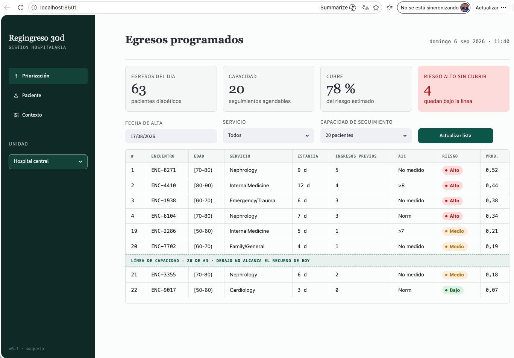
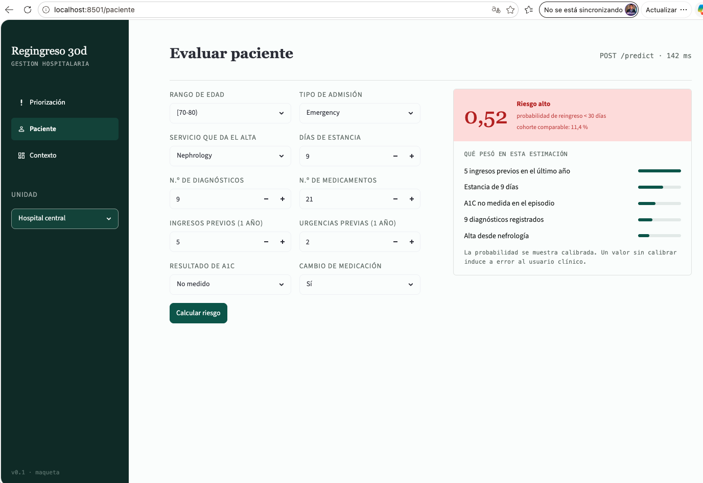
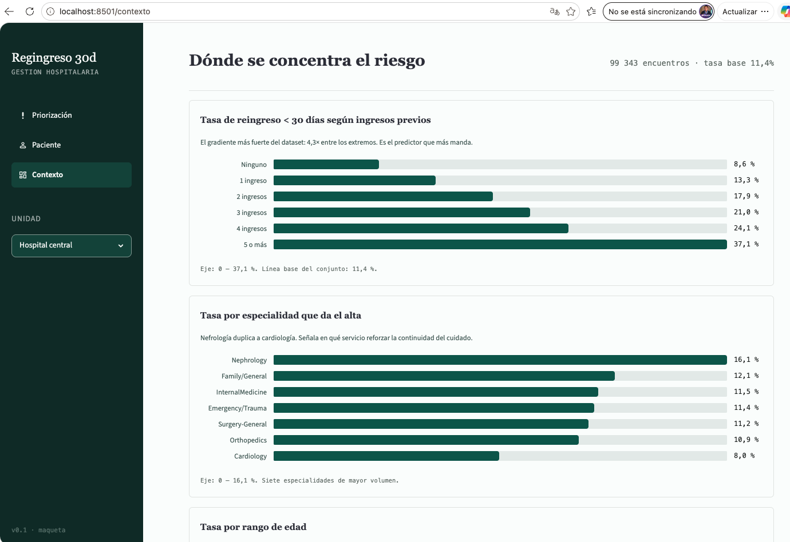
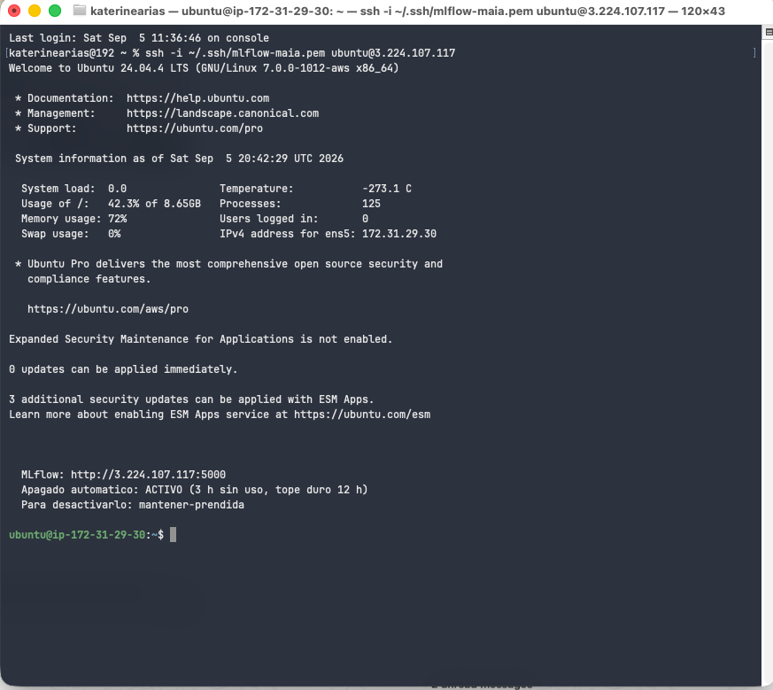
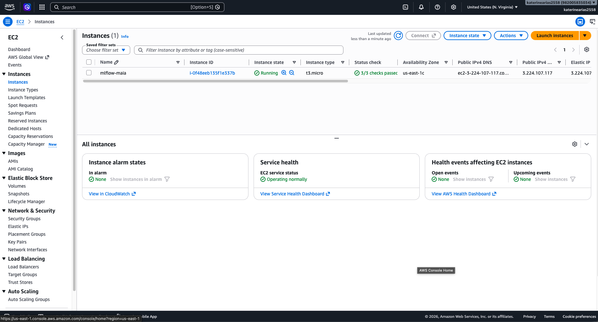
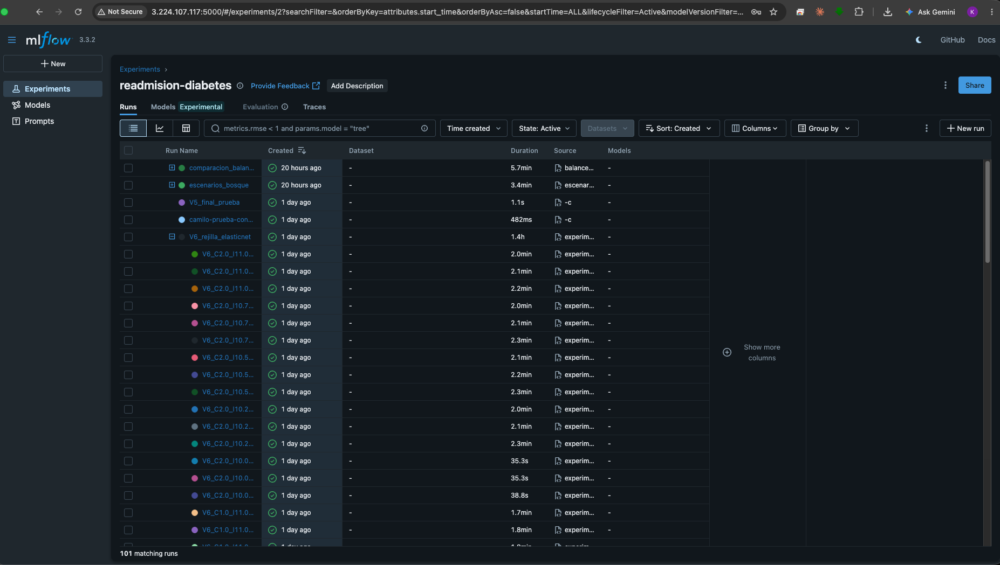

# 1. Resumen del problema

## 1.1 Contexto del problema

El reingreso hospitalario temprano, entendido como una nueva hospitalizacion
dentro de los 30 dias posteriores al alta, representa una utilizacion repetida
de servicios en un periodo corto y una oportunidad de fortalecer el seguimiento
tras el egreso. Cuando la institucion dispone de capacidad limitada para
llamadas o controles posteriores, la priorizacion suele depender del criterio
clinico individual y de las condiciones operativas del alta, sin que la
capacidad se asigne necesariamente primero a los pacientes de mayor riesgo. El
prototipo aborda ese vacio: no reemplaza el criterio clinico, sino que ordena
la lista de egresos del dia segun una estimacion comparable de riesgo.

## 1.2 Pregunta de negocio y alcance

**Que pacientes diabeticos van a reingresar al hospital dentro de los 30 dias
siguientes al alta.**

La pregunta se responde el dia del alta, antes de que el paciente salga, y
alimenta una decision concreta: a que pacientes se les programa control tras el
egreso. El usuario es el personal de enfermeria de la unidad de gestion
hospitalaria. El prototipo contempla dos usos complementarios: ordenar el
listado completo de egresos del dia segun probabilidad estimada, y consultar
individualmente a un paciente.

Queda fuera del alcance estimar la causa del reingreso, sugerir tratamientos y
reemplazar el criterio clinico. Tampoco hay conexion directa a un sistema de
informacion hospitalario: el listado de egresos se carga como archivo. La
variable `race` se reserva para evaluar el desempeno entre grupos y no se usa
como predictora. Los registros corresponden a hospitales de Estados Unidos
entre 1999 y 2008, de modo que los patrones identificados no se generalizan
automaticamente a una poblacion hospitalaria actual: el resultado es un
prototipo metodologico.

## 1.3 Conjuntos de datos

Se emplea *Diabetes 130-US Hospitals for Years 1999-2008* (UCI Machine Learning
Repository, dataset 296, licencia CC BY 4.0). De los 101.766 encuentros
originales se excluyeron 2.423 (2,38%): 1.652 de pacientes fallecidos, que no
pueden reingresar, y 771 con egreso a hospicio, cuyo objetivo de cuidado es
distinto. La base analitica queda en **99.343 encuentros de 69.990 pacientes**,
con una tasa de reingreso temprano del **11,4%**. La variable objetivo es
binaria: positivo cuando `readmitted` es `<30`. Los datos se versionan con DVC;
en Git viaja unicamente el puntero.

## 1.4 Cambios respecto a la Entrega 1

- **Se separo el repositorio en dos.** Modelos y API en
  `maia-pds-microproyecto-api`, tablero en el suyo; en la Entrega 1 todo estaba
  en `microproyecto-desarrollo-soluciones`.
- **Se incorporo un servidor de MLflow sobre AWS EC2** como registro compartido,
  de modo que las versiones de modelo del equipo se comparan en un mismo lugar.
- El trabajo paso de la exploracion de los datos a la preparacion, entrenamiento
  y evaluacion del modelo predictivo.
- **La maqueta no cambio.** Se mantiene la version iterada en la semana 3, con
  las bandas de riesgo ancladas en la tasa general observada.
- El alcance, la pregunta de negocio y los conjuntos de datos se mantienen sin
  cambios respecto a la Entrega 1.

# 2. Modelos desarrollados y su evaluacion

## 2.1 Regresion logistica

A partir de la base analitica definida en la Entrega 1 se desarrollo una
regresion logistica para estimar el riesgo de reingreso antes de 30 dias. La
particion entrenamiento / validacion / prueba se realizo **por paciente**, con
63.670 / 15.852 / 19.821 encuentros y cero pacientes compartidos entre
particiones. Los hiperparametros, pesos de clase y umbral se seleccionaron sobre
**validacion**; **prueba** se reservo para reportar el desempeno final.

El principal reto fue el desbalance: solo el 11,39% de los encuentros son
reingresos antes de 30 dias. La regresion base alcanzo 88,24% de exactitud en
validacion pero apenas 2,00% de recall, evidencia de que una exactitud elevada
no significa identificar la clase de interes. A partir de ahi se evaluaron
balanceo de clases, regularizacion, pesos para la clase positiva, ajuste del
umbral y una alternativa con Elastic Net.

| Version | Conjunto | Cambio principal | ROC-AUC | PR-AUC | Recall |
|---|---|---|---|---|---|
| V1 | Validacion | Regresion base | 0,6637 | 0,2207 | 2,00% |
| V2 | Validacion | Balanceo de clases | 0,6655 | 0,2208 | 54,61% |
| V3 | Validacion | Regularizacion C=0,5 | 0,6658 | 0,2208 | 54,40% |
| V4 | Validacion | Peso positivo=5 | 0,6654 | 0,2209 | 29,95% |
| V6 | Validacion | Elastic Net + utilizacion previa | 0,6658 | 0,2195 | 13,01% |
| **V5** | **Prueba** | **Peso positivo=5; umbral=0,30** | **0,6589** | **0,2133** | **81,56%** |

Las seis versiones y sus barridos de selección se registraron en MLflow. Adicionalmente, la configuración seleccionada de V5 se registró como `V5_final_prueba`, utilizando el conjunto de prueba exclusivamente para confirmar el desempeño final. Esta corrida conserva C=0,5, peso positivo=5 y umbral=0,30, con un recall de 81,56%. Para V6 se ejecutó una rejilla completa de 75 combinaciones de Elastic Net. La fila de V6 corresponde a su mejor configuración por PR-AUC en validación (C=0,5, l1_ratio=0,5, peso positivo=3).

{width=5.3in}

**Figura 1.** Recall y precision en validacion segun el umbral de decision,
sobre la version con peso positivo 5. El umbral seleccionado (0,30) es el punto
donde el recall todavia supera el 80% antes de la caida pronunciada de los
umbrales mas altos.

## 2.2 Bosque aleatorio

En paralelo se desarrollo un bosque aleatorio sobre la misma base analitica,
con dos decisiones que lo hacen comparable con la regresion: el conjunto
reservado es el mismo (19.821 encuentros, 2.207 reingresos) y el manejo del
desbalance se fija en peso 5 para la clase positiva con umbral 0,30, los mismos
valores de la version V5. Los escenarios se comparan entre si por recall de
validacion cruzada de cinco pliegues agrupada por paciente, dentro del conjunto
de entrenamiento; el reservado se usa una sola vez, para reportar.

Se recorrieron cuatro configuraciones del arbol, de menos a mas regulado:

| Escenario | Cambio principal | ROC-AUC | PR-AUC | Recall | Precision |
|---|---|---|---|---|---|
| V1 | Sin restricciones | 0,6607 | 0,2077 | 27,50% | 23,50% |
| **V2** | **Profundidad maxima 12** | **0,6673** | **0,2123** | **90,48%** | **12,83%** |
| V3 | Minimo 50 casos por hoja | 0,6634 | 0,2049 | 92,75% | 12,50% |
| V4 | Criterio de entropia sobre V3 | 0,6636 | 0,2060 | 92,25% | 12,49% |

Sobre el escenario V2 se contrastaron ademas siete formas de manejar el
desbalance, seleccionando por F2 —que pesa el doble la sensibilidad, porque el
falso negativo es el error caro. Ninguna tecnica de remuestreo supero al
ponderado simple: entrenar sobre la distribucion original deja el recall en
1,99%; el submuestreo lo lleva a 99,28% pero con precision de 11,37%, apenas por
encima de la prevalencia; y NearMiss degrada el ordenamiento, con ROC-AUC de
0,5633 frente a 0,66-0,67 de todas las demas. El remuestreo se aplica dentro del
pipeline: hacerlo antes de particionar copiaria informacion de los pacientes de
evaluacion hacia el entrenamiento.

## 2.3 Comparacion y seleccion entre familias

| Modelo | ROC-AUC | PR-AUC | Recall | Precision | Falsos negativos |
|---|---|---|---|---|---|
| Regresion logistica V5 | 0,6589 | 0,2133 | 81,56% | 14,00% | 407 |
| Bosque aleatorio V2 | 0,6673 | 0,2123 | 90,48% | 12,83% | 210 |

Sobre el mismo conjunto reservado y el mismo umbral, las dos familias quedan
practicamente empatadas en capacidad de ordenamiento: 0,0084 de ROC-AUC y 0,0010
de PR-AUC las separan. Lo que difiere es el punto de operacion. El bosque deja
escapar 210 reingresos frente a 407 de la regresion, y a cambio consume mas
cupos de seguimiento por cada acierto.

**Se selecciona el bosque aleatorio V2 para empaquetar.** Con una capacidad de
seguimiento fija, la diferencia que importa es cuantos reingresos quedan sin
detectar, y el bosque reduce esa cifra casi a la mitad sin costo medible en
ordenamiento. La regresion V5 se conserva como alternativa: es mas simple de
servir y su precision es un punto mayor, de modo que si la capacidad operativa
resulta mas estrecha de lo previsto, el cambio de familia esta justificado sin
reprocesar nada.

---

# 3. Observaciones y conclusiones sobre los modelos

El desbalance golpeo directamente a la regresion base: exactitud alta y apenas
2,00% de recall en validacion. La configuracion final V5 alcanzo 81,56% de
recall en prueba, identificando 1.800 de los 2.207 reingresos con 407 falsos
negativos, a cambio de una precision de 14,00%. El 10% de casos con mayor riesgo
estimado concentra ademas el 22,97% de los reingresos, con un lift de 2,30x, lo
que respalda usar la probabilidad para priorizar segun la capacidad disponible.

El registro sistematico de los experimentos permite una observacion que no es
visible al comparar solo la configuracion final. **Ninguna de las variantes
mejoro la capacidad de ordenamiento del modelo.** El PR-AUC en validacion se
mantiene entre 0,2165 y 0,2209 a lo largo de las 93 corridas de seleccion: el
barrido de regularizacion entre C=0,1 y C=10 lo mueve 0,00053; el del peso de la
clase positiva lo deja constante en 0,2209; y la rejilla de 75 combinaciones de
Elastic Net va de 0,2165 a 0,2195, es decir que su mejor configuracion queda por
debajo de los modelos mas simples.

Lo que cambia entre versiones no es que tan bien el modelo ordena a los
pacientes por riesgo, sino **donde se coloca el punto de corte**: el peso de
clase y el umbral desplazan el equilibrio entre recall y precision sobre la
misma curva, como muestra la Figura 1. La seleccion de V5 es entonces una
decision operativa sobre la tolerancia a falsos negativos, no el hallazgo de un
modelo superior.

El bosque aleatorio se desarrollo por separado y llego a la misma conclusion por
otro camino. A lo largo de los cuatro escenarios de arbol, las siete tecnicas de
balanceo y los pesos probados, **el ROC-AUC se mantuvo entre 0,656 y 0,673**,
con la unica excepcion de NearMiss, que lo degrada a 0,5633. Cambiar de familia
tampoco movio el techo: menos de 0,01 de ROC-AUC separa a las dos. Que dos
personas lo encontraran de forma independiente le da mas peso al hallazgo.

Ese techo coincide con lo que reporta la literatura sobre este conjunto de datos
(0,63-0,70) y con el desempeno del indice LACE, el instrumento clinico de
referencia para predecir readmision (0,68-0,70). El limite no esta en el
modelamiento sino en la informacion de los registros administrativos: mejorar
exige variables que el dataset no trae, y ese es el insumo de la proxima
iteracion.

Lo que si movio la sensibilidad fue la profundidad del arbol, de forma abrupta:
de 27,50% sin restricciones a 90,48% limitandola a doce niveles, sin que el
tamano del bosque ni el criterio de particion cambiaran nada apreciable. La
causa no es solo el sobreajuste. Un arbol que memoriza produce probabilidades
concentradas cerca de cero y de uno, y un umbral fijo en 0,30 las clasifica casi
todas como negativas. Regular la profundidad devuelve probabilidades
intermedias, y es sobre esas probabilidades que el tablero ordena la lista de
egresos: mal distribuidas, el orden que ve enfermeria deja de ser util aunque el
ROC-AUC no se entere.

---

# 4. Descripcion del tablero y la funcionalidad que ofrece

En esta iteración se genera la primera versión del tablero en `streamlit`, basada
en la maqueta inicial, con una arquitectura modular que separa vistas,
componentes, configuración y servicio, y una paleta que define el *look and feel*
del producto. La capa API se mantiene como servicio independiente, para integrar
frontend y backend en la siguiente iteración. El tablero cuenta con tres menús:

- **Priorización**: panel de los egresos programados, con cuatro tarjetas —egresos
del día, capacidad de seguimiento, cobertura de riesgo estimada y riesgo de no
cobertura— y una tabla de detalle con filtros por fecha de alta, servicio
hospitalario y capacidad de seguimiento.

{width=5.3in}

**Figura 2.** Vista de priorización. La línea de capacidad separa los pacientes
que alcanzan el recurso del día de los que quedan por debajo, que es la
decisión que el tablero apoya.

- **Paciente**: registra el encuentro y captura los datos que consume el modelo
—rango de edad, tipo de admisión, servicio que da el alta, días de estancia,
número de diagnósticos y de medicamentos, ingresos y urgencias previas (1 año),
resultado de A1C y cambio de medicación—. Es la vista que invoca la API de
predicciones.

{width=5.3in}

**Figura 3.** Vista de paciente. El formulario ya envía el encuentro por HTTP a
`POST /predict`; la tarjeta de resultado muestra valores ilustrativos porque el
API que la responde es entregable de la semana 6.

- **Contexto**: visual analítica de dónde se concentra el riesgo, con barras
horizontales de la tasa de reingreso < 30 días por ingresos previos, por
especialidad que da el alta y por rango de edad.

{width=5.3in}

**Figura 4.** Vista de contexto, con los hallazgos descriptivos de la Entrega 1
puestos frente al usuario clínico.

Las tres capturas corresponden a la ejecución local (`localhost:8501`). El
tablero además está desplegado y accesible en
[Railway](https://maia-pds-microproyecto-ui-production.up.railway.app), con una
ruta por vista: `/`, `/paciente` y `/contexto`.

## 4.1 Deuda tecnica del tablero

El despliegue destapó tres defectos de tema que el ambiente local no mostraba:
texto blanco sobre blanco en modo oscuro, `sidebar` que no reabría una vez
colapsado y `selectbox` ilegible tras el cambio de BaseWeb a react-aria en
Streamlit 1.63. Los tres se corrigieron fijando el tema. Que solo aparecieran en
producción sustenta la deuda que queda: no hay pruebas de front que atrapen
regresiones visuales, y la integración con el API se aborda en la semana 6.

---

# 5. Fuentes, repositorios y soporte de los experimentos

El codigo vive en dos repositorios publicos, uno por unidad desplegable. La
separacion vuelve estructural la frontera que exige el enunciado: el tablero no
puede importar el modelo ni cargar el artefacto serializado, solo hablar con la
API por HTTP. El historial de commits de cada integrante esta en
[el repositorio principal](https://github.com/katterine2558/maia-pds-microproyecto-api/commits/main/) y en [el del tablero](https://github.com/katterine2558/maia-pds-microproyecto-ui/commits/main/).

## 5.1 Fuentes de los modelos desarrollados

En [maia-pds-microproyecto-api](https://github.com/katterine2558/maia-pds-microproyecto-api):

| Ruta | Contenido |
|---|---|
| `src/features/` | Base analitica y matriz de diseno |
| `src/models/particion.py` | Particion por paciente, sin pacientes compartidos entre conjuntos |
| `src/models/regresion_logistica.py`, `busqueda.py`, `regresion_v6.py`, `optimizar_recall.py` | Versiones V1 a V6 de la regresion, rejillas de hiperparametros y ajuste de umbral |
| `src/models/escenarios.py`, `balanceo.py` | Los cuatro escenarios del bosque aleatorio y las siete tecnicas de desbalance |
| `src/models/metricas.py`, `evaluacion_priorizacion.py` | Metricas comunes a las dos familias y analisis de lift por capacidad |
| `src/models/experimentos_mlflow.py` | Registro de corridas contra el servidor de MLflow en EC2 |
| `notebooks/modelos.ipynb` | Cuaderno ejecutado del bosque aleatorio |
| `docs/soportes/modelos/` | Metricas de cada version en CSV |

## 5.2 Fuentes del tablero desarrollado

En [maia-pds-microproyecto-ui](https://github.com/katterine2558/maia-pds-microproyecto-ui):

| Ruta | Contenido |
|---|---|
| `app.py`, `config/` | Punto de entrada, navegacion y tema |
| `views/` | `priorizacion.py`, `paciente.py` y `contexto.py`: una vista por pantalla de la maqueta |
| `components/` | Tarjetas de metrica, tabla de priorizacion, graficos y barra lateral |
| `services/api.py` | Unico punto de salida hacia la API; el tablero no importa el modelo |
| `Dockerfile`, `railway.json`, `.streamlit/` | Artefactos de despliegue |
| `ux-ui/` | Maqueta de la Entrega 1, contra la que se contrasta la implementacion |

## 5.3 Experimentos en MLflow

Los experimentos se registran en un servidor de MLflow montado sobre una
instancia EC2 de AWS, compartido por el equipo y protegido con autenticacion.
Cada corrida queda asociada al autor del modelo, de modo que las versiones de
las dos familias se comparan en un mismo lugar.

{width=6.2in}

**Figura 5.** Sesion SSH contra la maquina EC2 que hospeda MLflow. Se ven el
usuario `ubuntu`, el nombre de la instancia con su IP privada y la IP publica
en el comando de conexion.

{width=6.2in}

**Figura 6.** Consola de AWS con la instancia `mlflow-maia` en ejecucion, su IP
publica 3.224.107.117, la Elastic IP asociada y el usuario de la cuenta. Al
cierre de la entrega la instancia queda **detenida**, no terminada, para que
pueda verificarse despues; la constancia esta en
`docs/soportes/ec2-mlflow-detenida.txt`.

{width=6.2in}

{width=6.2in}

**Figura 7.** Interfaz de MLflow servida desde la EC2, con detalle de la barra de
direcciones: `3.224.107.117:5000`, la misma IP publica de la Figura 6. El
experimento `readmision-diabetes` acumula 101 corridas de las dos familias:
`comparacion_balanceo` y `escenarios_bosque` del bosque aleatorio,
`V5_final_prueba` de la regresion y la rejilla `V6_rejilla_elasticnet` con sus
75 combinaciones como corridas anidadas.
