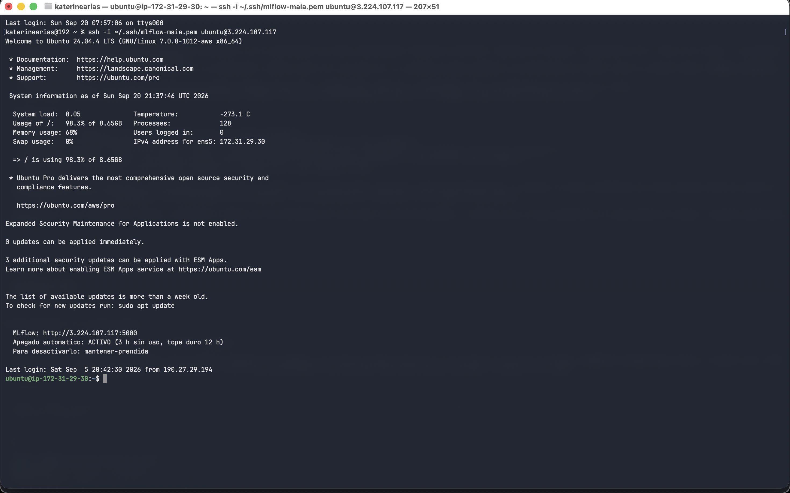
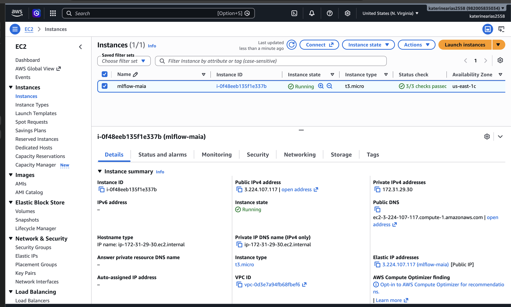
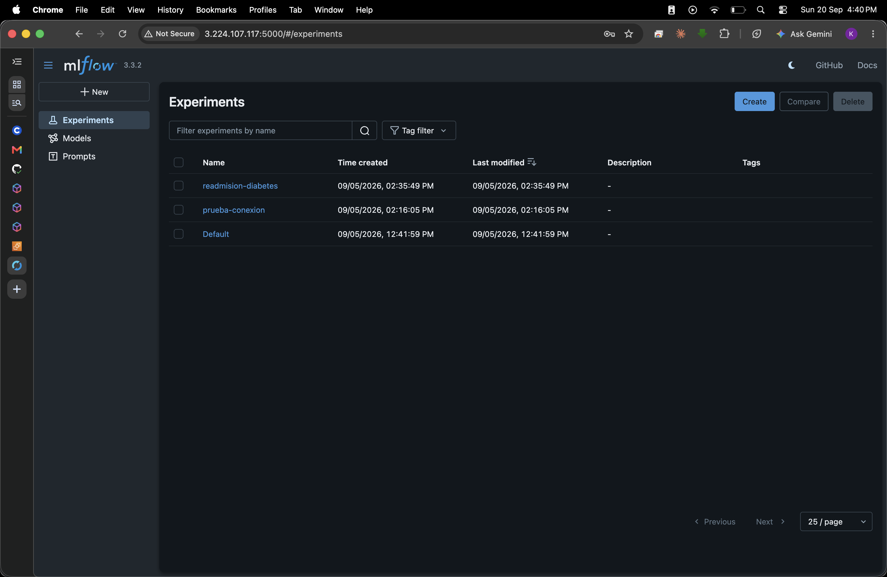
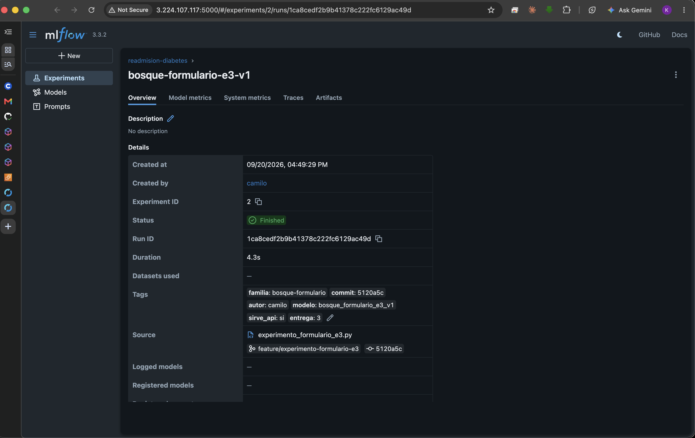

# 1. Resumen sobre el problema

Los pacientes diabéticos pueden requerir nuevas hospitalizaciones poco después del alta. Para el personal de enfermería, identificar a quién contactar primero es una tarea difícil cuando el número de egresos supera la capacidad disponible para seguimiento. La pregunta que orienta este proyecto es: **¿qué pacientes diabéticos presentan mayor riesgo de reingresar durante los 30 días posteriores al alta?**

El proyecto busca apoyar la organización de los contactos posteriores al egreso mediante un tablero que permita consultar el riesgo estimado de un paciente y ordenar un listado de egresos. La predicción sirve como apoyo para asignar la capacidad de seguimiento. No establece tratamientos ni reemplaza la valoración clínica.

Se utiliza el conjunto *Diabetes 130-US Hospitals for Years 1999-2008* del UCI Machine Learning Repository. De sus 101.766 encuentros originales se excluyeron 1.652 registros de pacientes fallecidos y 771 egresos a hospicio. La base analítica quedó conformada por **99.343 encuentros de 69.990 pacientes**. Aproximadamente el **11,4 %** de los encuentros registra un reingreso antes de 30 días, identificado mediante el valor `<30` de la variable `readmitted`.

En la Entrega 2 se compararon los modelos y se desarrollaron las primeras vistas del tablero, con resultados ilustrativos en pantalla. En esta entrega se preparó un modelo ajustado a los campos del formulario, se desarrolló y empaquetó la API, y las dos vistas que emplean el modelo dejaron de mostrar ejemplos: Paciente consulta un encuentro y Priorización ordena el archivo de egresos del turno, ambas contra la API. La solución completa se levanta en contenedores con un solo comando.

Los datos fueron recopilados en hospitales de Estados Unidos entre 1999 y 2008. Los resultados obtenidos con esta base no acreditan el desempeño del modelo en hospitales colombianos ni con pacientes actuales.

# 2. Modelos desarrollados y su evaluación

Para preparar los datos se trataron variables administrativas y clínicas, se agruparon diagnósticos ICD-9 y se transformaron las variables categóricas. El identificador `patient_nbr` se utilizó para separar los conjuntos sin compartir pacientes entre entrenamiento y prueba, pero no como predictor. La variable `race` se reservó para examinar el comportamiento entre grupos y tampoco se incorporó como entrada.

Las variables se ordenaron por importancia por permutación. Esa importancia se mide sobre el conjunto de entrenamiento: calcularla sobre el conjunto reservado dejaba optimista la cifra final, y se corrigió. Los candidatos se compararon con validación cruzada agrupada y estratificada por paciente (`StratifiedGroupKFold`). El remuestreo (SMOTE y variantes) y el umbral se ajustan dentro de cada *fold*, y la selección usa F2, que pesa el doble la sensibilidad. El conjunto de prueba se usó una sola vez, con el ganador ya elegido.

En la Entrega 2 se compararon modelos de regresión logística y bosque aleatorio. La regresión inicial alcanzó **88,24 % de exactitud** en validación, pero identificó apenas el **2,00 % de los reingresos**. Por ello se evaluaron configuraciones dirigidas a mejorar la detección de la clase positiva. La comparación final se realizó entre la regresión logística V5 y el bosque aleatorio V2 sobre **19.821 encuentros de prueba**, incluidos **2.207 reingresos**.

| Modelo | ROC-AUC | PR-AUC | Recall | Precisión | Falsos negativos |
|---|---:|---:|---:|---:|---:|
| Regresión logística V5 | 0,6589 | 0,2133 | 81,56 % | 14,00 % | 407 |
| Bosque aleatorio V2 | 0,6673 | 0,2123 | 90,48 % | 12,83 % | 210 |

Se escogió el bosque V2 porque, al umbral evaluado, dejó sin identificar **210 reingresos**, frente a **407** de la regresión. La precisión de **12,83 %** advierte, sin embargo, que numerosos pacientes señalados para seguimiento no reingresaron en el periodo observado. El número de alertas debe examinarse en relación con los contactos que el equipo de enfermería pueda realizar.

En la regresión V5, el 10 % de encuentros con mayor riesgo estimado concentró el **22,97 % de los reingresos**, con un *lift* de **2,30**. Esta medición corresponde únicamente a dicha regresión.

Al preparar la integración se encontró que el bosque V2 había sido entrenado con más variables que las diez solicitadas en el formulario Paciente. Se entrenó entonces `bosque_formulario_e3_v1` con los campos disponibles en esa vista. La separación agrupada por paciente dejó **79.522 encuentros para entrenamiento** y **19.821 para prueba**, con **2.207 reingresos** en este último conjunto. El pipeline combina el procesamiento de categorías con un bosque de **400 árboles**, profundidad máxima de **12**, peso positivo de **5** y umbral de **0,30**.

**Métricas de `bosque_formulario_e3_v1` en la prueba local:** ROC-AUC 0,6310 · PR-AUC 0,1929 · recall 90,89 % · precisión 12,26 % · 201 falsos negativos.

El modelo del formulario obtuvo valores menores de ROC-AUC y PR-AUC que el bosque V2. Las métricas de los dos modelos deben mantenerse diferenciadas: la predicción mostrada en Paciente proviene de `bosque_formulario_e3_v1`, mientras que los resultados de V2 corresponden al modelo estudiado en la Entrega 2 con más variables de entrada.

El modelo que sirve la API quedó registrado en el servidor de MLflow sobre EC2, en el experimento `readmision-diabetes`, bajo la corrida `bosque-formulario-e3-v1` (`1ca8cedf2b9b41378c222fc6129ac49d`), con sus once parámetros, sus métricas y el artefacto empaquetado. El registro se hizo con `src/models/experimento_formulario_e3.py`, que separa el experimento del entrenamiento: `entrenar_formulario_e3.py` debe poder correrse sin credenciales ni red al empaquetar la API, mientras que el registro exige el servidor arriba.

Al registrar la corrida se volvió a entrenar el modelo y las métricas no resultaron idénticas a las de la primera ejecución, pese a compartir `random_state=42`: ROC-AUC pasó de 0,6292 a 0,6310 y los falsos negativos bajaron de 223 a 201. La diferencia proviene del entorno de ejecución —versión de scikit-learn y el paralelismo de `n_jobs=-1` en el bosque—, no de un cambio en los datos ni en los hiperparámetros. Las cifras reportadas arriba son las de la corrida registrada en MLflow, que corresponden al artefacto que efectivamente sirve la API: la reproducibilidad exacta entre máquinas exigiría fijar también las versiones de las bibliotecas.

## 2.1 Trazabilidad del modelo desplegado

Para confirmar que el modelo servido por la API es exactamente el registrado en MLflow, se comparó el artefacto versionado en el repositorio (`api/artifacts/modelo.joblib`, hash MD5 `ad63f34ab693f5563d4c81647ca5b6df`) contra el artefacto almacenado por la corrida `bosque-formulario-e3-v1` en el servidor de MLflow: **mismo tamaño exacto, 7.870.468 bytes**, y las mismas cuatro métricas de prueba reportadas arriba. El commit que subió el artefacto (`28c118a`, 20 de septiembre, 16:53) es cuatro minutos posterior al registro de la corrida en MLflow (16:49), consistente con lo que ese mismo commit documenta: el artefacto se regeneró al registrar y se conservaron esas métricas para que el archivo que sirve la API y la corrida en MLflow describan el mismo modelo.

Esta cadena —hash del archivo, tamaño, métricas y orden temporal de los commits— confirma que no hay divergencia entre lo documentado y lo que efectivamente responde `POST /predict`, ni en el servidor propio ni en Railway (sección 4).

# 3. Descripción del tablero desarrollado y su funcionalidad

El tablero está desarrollado en Streamlit y contiene las vistas **Paciente**, **Priorización** y **Contexto**. La API, desarrollada en FastAPI, recibe los datos del encuentro, ejecuta el pipeline y devuelve la probabilidad estimada, el umbral y la versión del modelo. El tablero consulta este servicio por HTTP y no carga el artefacto: el repositorio del tablero no contiene `joblib` ni `scikit-learn`, y toda comunicación pasa por un único módulo, `services/api.py`.

**Paciente** solicita los diez datos del encuentro y presenta la respuesta de `POST /predict`: la probabilidad, el nivel de riesgo, el umbral de decisión y la versión del modelo. El nivel se calcula contra dos referencias: es *alto* cuando la probabilidad alcanza el umbral que devuelve la API —lo que el modelo marca para seguimiento—, *medio* entre la tasa base del conjunto (11,4 %) y ese umbral, y *bajo* por debajo. Si la API falla, la vista muestra el error y retira el resultado anterior, para que nadie lea la estimación de otro paciente como si fuera la del actual.

**Priorización** recibe el archivo de egresos del turno en CSV, valida sus columnas antes de la primera llamada, pide una predicción por fila y devuelve la lista ordenada de mayor a menor riesgo. Las llamadas se resuelven en paralelo y un egreso que falle no tumba el lote: la vista lo descuenta e informa cuántos quedaron fuera. Sobre la lista, cuatro indicadores —egresos cargados, capacidad, porción del riesgo cubierta y pacientes de riesgo alto por debajo de la línea— y una línea de capacidad que separa a quienes alcanzan los recursos del turno. La lista se puede filtrar por servicio y descargar.

**Contexto** ofrece gráficas descriptivas del conjunto de datos: tasa de reingreso por ingresos previos, por especialidad que da el alta y por rango de edad. Son datos poblacionales históricos y no representan predicciones individuales. Con esta vista el tablero cumple las dos funciones que exige el enunciado: emplear el modelo a través de la API y visualizar otros datos relevantes para el usuario.

En pruebas, `/health` respondió con `{"estado":"ok","modelo":"bosque_formulario_e3_v1"}`, y la API rechazó con estado **422** una estancia de cero días. Sobre un archivo de 28 egresos, Priorización resolvió el lote en 0,43 s y ordenó la lista de 0,59 a 0,29.

En Paciente, un encuentro de referencia —edad `[70-80)`, admisión `Emergency`, servicio `Nephrology`, nueve días de estancia, nueve diagnósticos, 21 medicamentos, cinco ingresos previos, dos visitas previas a urgencias, A1C no medido y cambio de medicación `Sí`— devolvió una **probabilidad de 0,64**, **riesgo alto**, umbral **0,30** y versión **`bosque_formulario_e3_v1`**.

# 4. Despliegue del tablero y la API

La solución se despliega en contenedores. El tablero y la API viven en repositorios separados —`-ui` y `-api`— y cada uno trae su `Dockerfile`; la pieza que los integra es el `docker-compose.yml` del repositorio de la API, que construye ambos servicios y los pone en la misma red.

```
docker compose up --build
    tablero  :8501   →   API  :8000   →   modelo empaquetado en la imagen
```

El tablero recibe `API_URL=http://api:8000`: dentro de la red de Compose la API se alcanza por el nombre del servicio, no por `localhost`, que allí es el propio contenedor del tablero. El servicio del tablero espera el *healthcheck* de la API y no solo su arranque, porque `/health` responde 503 mientras el artefacto del modelo no esté cargado. El modelo viaja dentro de la imagen —`api/artifacts/modelo.joblib` está versionado en Git—, de modo que el contenedor no descarga nada al desplegarse.

La cadena completa se verificó en contenedores: ambos servicios *healthy*, `/health` respondiendo con la versión del modelo, y el encuentro de referencia devolviendo 0,6355 tanto por `curl` contra la API como desde el contenedor del tablero. En pantalla, la vista Paciente lo muestra como **0,64 · riesgo alto · umbral 0,30**. Adicionalmente se verificó el mismo despliegue de punta a punta en un servidor propio (EC2 Ubuntu con Docker Compose), con los dos contenedores en estado *healthy* y reinicio automático.

**El tablero y la API están desplegados en Railway.** El tablero corre en <https://maia-pds-microproyecto-ui-production.up.railway.app>, con despliegue continuo desde `develop`. La API se construyó desde el mismo `Dockerfile` (`api/railway.json`), pero **como servicio interno sin dominio público**: solo es alcanzable por la red privada de Railway, sobre IPv6 (el `Dockerfile` ajusta `uvicorn` para escuchar en `::` en lugar de `0.0.0.0`, necesario para esa red). El tablero consume la API por esa red privada, no por internet pública. Con la conexión activa, la vista Paciente en producción reprodujo la predicción ya verificada en contenedores: **0,64 · riesgo alto · umbral 0,30 · `bosque_formulario_e3_v1`**, y la vista Priorización procesó el archivo de ejemplo correctamente, confirmando el flujo completo en el ambiente publicado.

# 5. Principales resultados y conclusiones

**El prototipo funciona de extremo a extremo, en producción.** El tablero consulta el modelo a través de la API por HTTP, sin importar el artefacto ni leer los datos: el repositorio del tablero no contiene `joblib` ni `scikit-learn`, de modo que la frontera no depende de disciplina sino de que la pieza no está ahí. Las dos vistas que emplean el modelo —Paciente para un encuentro, Priorización para la lista del turno— se probaron contra la API en contenedores, en un servidor propio y en Railway.

**Ningún modelo alcanzó un poder discriminante alto.** El mejor resultado sobre las 19.821 pruebas fue un ROC-AUC de 0,667 (bosque V2), y el modelo de diez variables que sirve la API llega a 0,631. Son valores modestos: las variables administrativas del conjunto no bastan para separar con claridad quién reingresa. La conclusión útil no es el AUC sino el ordenamiento: en la regresión V5, el 10 % de encuentros con mayor riesgo estimado concentró el 22,97 % de los reingresos, un *lift* de 2,30. Para repartir una capacidad de seguimiento limitada, ordenar por riesgo estimado es mejor que no ordenar, aunque el modelo esté lejos de ser un clasificador confiable.

**La precisión del 12,3 % es el resultado que más condiciona el uso.** Al umbral de 0,30, el modelo recupera el 90,9 % de los reingresos, y el precio es señalar de más: al cargar un archivo de 28 egresos, la vista Priorización marcó 27 como riesgo alto. La etiqueta, por sí sola, no discrimina; lo que el equipo de enfermería debe usar es el orden de la lista y la línea de capacidad. Esta es la razón de que el tablero muestre siempre el umbral junto a la probabilidad y de que la lista se entregue ordenada y no filtrada.

**Reducir el modelo a las diez variables del formulario cuesta poco.** Al integrar la API se encontró que el bosque V2 usaba más variables de las que el formulario pide, así que se entrenó `bosque_formulario_e3_v1` solo con las disponibles en pantalla. El ROC-AUC bajó de 0,667 a 0,631 y la PR-AUC de 0,2123 a 0,1929. La pérdida es real pero pequeña frente a la ganancia de usabilidad: quien consulta el tablero llena diez campos que conoce al momento del alta.

**El entrenamiento no es reproducible entre máquinas, pero el artefacto desplegado es trazable.** Registrar la corrida en MLflow exigió volver a entrenar, y las métricas no salieron idénticas pese a compartir `random_state=42`: ROC-AUC pasó de 0,6292 a 0,6310 y los falsos negativos bajaron de 223 a 201. La causa está en el entorno —versión de `scikit-learn` y el paralelismo de `n_jobs=-1`—, no en los datos ni en los hiperparámetros. Para que un experimento sea reproducible no basta fijar la semilla: hay que fijar también las versiones de las bibliotecas. Lo que sí se verificó (sección 2.1) es que el artefacto que sirve la API hoy —en el servidor propio y en Railway— coincide en tamaño y métricas con el que MLflow tiene registrado.

**Límite del alcance.** Los datos provienen de hospitales de Estados Unidos entre 1999 y 2008. Los resultados no acreditan el desempeño del modelo en hospitales colombianos ni con pacientes actuales, y el tablero no sustituye la valoración clínica. Antes de cualquier uso real haría falta validar sobre datos locales y recientes, y revisar el comportamiento del modelo entre grupos de pacientes.

# 6. Soportes de la entrega

| Soporte | Dónde |
|---|---|
| Video (≤ 10 min) | [video_sustentacion_grupo6.mp4](https://uniandes-my.sharepoint.com/:v:/r/personal/l_almanzas_uniandes_edu_co/Documents/EntregaFinal_soluciones/video_sustentacion_grupo6.mp4?d=wb255bae57c974e818b9afa44c081dd8e&csf=1&web=1&nav=eyJyZWZlcnJhbEluZm8iOnsicmVmZXJyYWxBcHAiOiJPbmVEcml2ZUZvckJ1c2luZXNzIiwicmVmZXJyYWxBcHBQbGF0Zm9ybSI6IldlYiIsInJlZmVycmFsTW9kZSI6InZpZXciLCJyZWZlcnJhbFZpZXciOiJNeUZpbGVzTGlua0NvcHkifX0&e=OQf8yX) |
| Modelos, pipelines, API y artefacto empaquetado | [`maia-pds-microproyecto-api`](https://github.com/katterine2558/maia-pds-microproyecto-api) · release [`entrega-3`](https://github.com/katterine2558/maia-pds-microproyecto-api/releases/tag/entrega-3) |
| Fuentes del tablero | [`maia-pds-microproyecto-ui`](https://github.com/katterine2558/maia-pds-microproyecto-ui) · release [`entrega-3`](https://github.com/katterine2558/maia-pds-microproyecto-ui/releases/tag/entrega-3) |
| Datos versionados | DVC, remoto `storage` en S3 |
| Experimentos | MLflow sobre EC2, experimento `readmision-diabetes`: **115 corridas registradas** (Camilo 100 · Leonardo 13 · Katerine 2) |
| Artefactos de despliegue | `api/Dockerfile`, `Dockerfile` del tablero, `docker-compose.yml`, `api/railway.json` |
| Despliegue publicado | Tablero: <https://maia-pds-microproyecto-ui-production.up.railway.app> · API: servicio interno en Railway, sin dominio público |
| Manual de usuario | [`docs/manual-usuario.md`](https://github.com/katterine2558/maia-pds-microproyecto-ui/blob/entrega-3/docs/manual-usuario.md) del repositorio del tablero |
| Manual de instalación | [`docs/manual-instalacion.md`](https://github.com/katterine2558/maia-pds-microproyecto-ui/blob/entrega-3/docs/manual-instalacion.md) |

Capturas de la máquina de MLflow, con el usuario y la IP visibles en cada una. El procedimiento completo está en `docs/soportes/mlflow-ec2.md`; al cerrar la entrega la instancia queda **detenida, no terminada**.

**Sesión SSH**, con el prompt `ubuntu@ip-172-31-29-30` y la IP pública `3.224.107.117`:

{width=6.2in}

**Consola de EC2**, con la instancia `mlflow-maia` y su IP pública `3.224.107.117`:

{width=6.2in}

**Interfaz de MLflow**, servida sobre esa misma IP:

{width=6.2in}

**Corrida `bosque-formulario-e3-v1`**, con sus parámetros, métricas y artefactos:

{width=6.2in}


# 7. Reporte de trabajo en equipo

El trabajo se reparte por ítem de trabajo, no por persona: cada ítem vive en su propia rama `feature/*`, sale de `develop` y vuelve a `develop` mediante un *pull request*. Los merges conservan el historial completo, sin *squash* ni *rebase* que colapsen la autoría, de modo que el aporte de cada integrante queda verificable en el repositorio. `main` conserva únicamente los estados integrados de cada entrega, con su *tag*.

A lo largo del proyecto se abrieron pull requests en los dos repositorios: 35 de 36 integrados en el de modelos y API, y los 16 del tablero integrados.

## 7.1 Quién hizo qué

| Integrante | Contribución principal |
|---|---|
| Gineth Katerine Arias Carrillo | Infraestructura de datos (DVC, S3), servidor de MLflow en EC2 con su proxy autenticado, fuentes del tablero, integración de las vistas con la API, artefactos de despliegue y documentación |
| Camilo Andrés Rodríguez Dueñas | Regresión logística y sus versiones, modelo de diez variables para el formulario, servicio FastAPI y empaquetado del modelo, borradores de reporte y manuales |
| Leonardo Almanza Sánchez | Ingeniería de características, corrección de la fuga en la selección, escenarios de balanceo, barridos registrados como corridas anidadas en MLflow, pruebas automatizadas de la API, documentación de ejecución y despliegue |
| Jasbyn Rainier Solano Carrillo | Look and feel inicial del tablero (patrón de diseño, vistas, componentes, temas y navegación), línea base de infraestructura y arquitectura, despliegue en Railway del tablero y la API, integración tablero–API por red privada de Railway (IPv6), ajuste del *skeleton* de carga en el tablero |
