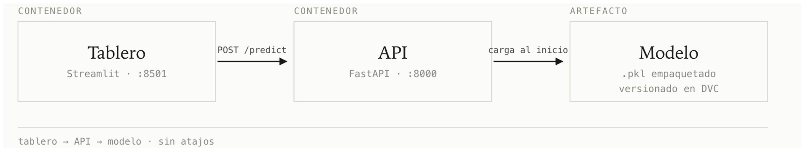
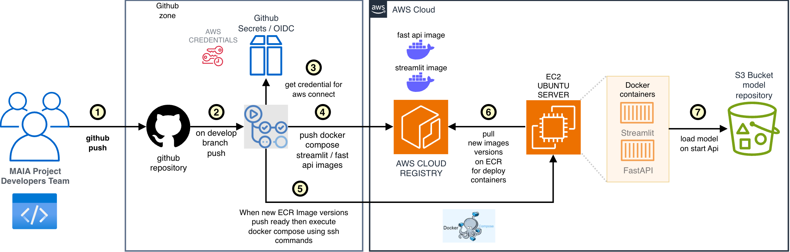
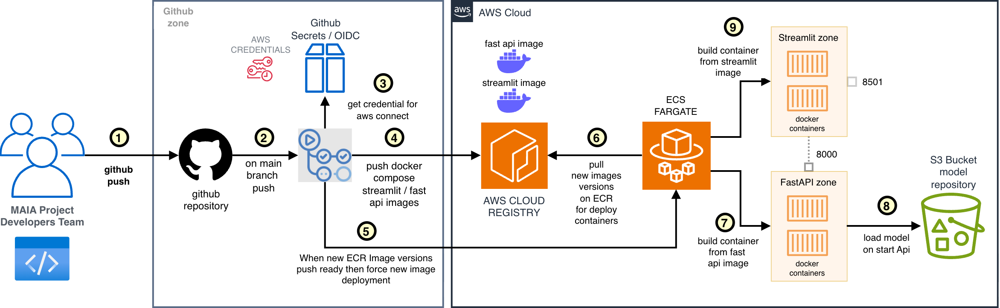

# Arquitectura de la Infraestructura

Con este documento se describe la arquitectura de la infraestructura tanto para el entorno de desarrollo como para producción. Este es un documento evolutivo, que seguramente experimentará cambios a medida que vayamos avanzando en el curso de Despliegues de modelos MAIA.

## ¿Qué se plantea?

Los diagramas iniciales valoran la propuesta de despliegue tentativa para un ambiente de desarrollo/staging y uno productivo, que por el momento plantea la estrategia de despliegue de la capa de API y FRONTEND.

## Arquitectura de referencia (5000 pies)

La siguiente es la propuesta de arquitectura del proyecto:



En nuestro `README.md` hemos planteado usar un stack basado en Streamlit y FastAPI, orquestado por Docker Compose. Desde luego, esto podría cambiar dependiendo de los contenidos que vayamos observando en el curso y los desafíos que nos encontremos durante la ejecución del proyecto. Con los conocimientos adquiridos hasta esta etapa, hemos diseñado la arquitectura inicial para API y FRONTEND únicamente.

## Versión inicial de la arquitectura de infraestructura y despliegue

Como lo mencionamos anteriormente, la arquitectura inicial se centra en los componentes de API y FRONTEND, omitiendo por el momento la capa de Modelo y el almacenamiento persistente, hasta que avancemos a las siguientes iteraciones después de observar los contenidos de MLOps, MLflow y CI/CD.

### Arquitectura Infra - Dev



Esta arquitectura considera el despliegue simple a una instancia EC2, automatizando la entrega de código a través de GitHub Actions, como se sugiere en el video de la semana 3: [Despliegue con GitHub Actions](https://www.youtube.com/watch?v=ZVWg18AXXuE).

Esta estrategia de CI/CD propone lo siguiente:

#### Pasos del pipeline de CI/CD

1. Ejecutar el pipeline de despliegue cuando nuestro equipo de desarrollo haga push en la rama `develop`.
2. Cuando GitHub Actions detecta el push a `develop`, inicia la ejecución del pipeline.
3. Recupera credenciales de AWS a través de GitHub Actions Secrets (no recomendado para producción) o establece una relación de confianza entre AWS y GitHub a través de OIDC (recomendado): [Use IAM roles to connect GitHub Actions to actions in AWS](https://aws.amazon.com/es/blogs/security/use-iam-roles-to-connect-github-actions-to-actions-in-aws/).
4. Ejecuta en el action los comandos para construir las imágenes Docker de Streamlit y FastAPI, luego hace login en ECR y las publica, versionando de forma atómica cada nueva imagen Docker.
5. Se conecta desde el action a la EC2 vía SSH (no recomendado para producción) para ejecutar los comandos `docker pull` (o `docker-compose` si preferimos construir a partir de Git y no de AWS ECR) que permitirán crear ambos contenedores en la EC2. Para conectarse a la EC2 y ejecutar comandos es mejor usar credenciales temporales de OIDC y el agente de Systems Manager (SSM).
6. La EC2 recupera las imágenes y crea los contenedores con la nueva versión del código (probablemente se necesite eliminar los que corren actualmente).
7. El contenedor de FastAPI carga el modelo desde S3 al iniciar.

#### Ejemplos de configuración

Es importante mencionar que para ejecutar GitHub Actions debemos almacenar el `<nombre-action-dev>.yml` en el folder `.github/workflows` en la raíz del proyecto. A continuación se muestra un ejemplo de un archivo `YAML` de GitHub Actions para obtener credenciales temporales vía OIDC:

```yaml
name: AWS OIDC Connect

on:
  push:
    branches:
      - main

permissions:
  id-token: write # Requerido para solicitar el token JWT de OIDC
  contents: read  # Requerido para hacer checkout del código

jobs:
  aws-oidc-job:
    runs-on: ubuntu-latest

    steps:
      - name: Checkout del código
        uses: actions/checkout@v4

      - name: Configurar credenciales de AWS via OIDC
        uses: aws-actions/configure-aws-credentials@v4
        with:
          role-to-assume: arn:aws:iam::<ACCOUNT_ID>:role/<NOMBRE_DEL_ROL>
          aws-region: us-east-1

      - name: Verificar la identidad en AWS
        run: |
          aws sts get-caller-identity
```

Vale la pena aclarar que el rol que asume el job de GitHub Actions debe estar configurado en AWS con los permisos adecuados:

```json
{
  "Version": "2012-10-17",
  "Statement": [
    {
      "Effect": "Allow",
      "Principal": {
        "Federated": "arn:aws:iam::<ACCOUNT_ID>:oidc-provider/token.actions.githubusercontent.com"
      },
      "Action": "sts:AssumeRoleWithWebIdentity",
      "Condition": {
        "StringEquals": {
          "token.actions.githubusercontent.com:aud": "sts.amazonaws.com"
        },
        "StringLike": {
          "token.actions.githubusercontent.com:sub": "repo:<USUARIO_O_ORG>/<NOMBRE_REPOSITORIO>:*"
        }
      }
    }
  ]
}
```

También se muestra un ejemplo de cómo ejecutar un comando remoto en la EC2 usando el agente SSM:

```yaml
name: Deploy to EC2 via SSM

on:
  push:
    branches: [ "main" ]

# Permiso obligatorio para usar OIDC con AWS
permissions:
  id-token: write
  contents: read

jobs:
  execute-commands:
    runs-on: ubuntu-latest
    steps:
      - name: Checkout del código
        uses: actions/checkout@v4

      # Autenticación segura mediante OIDC (sin claves en GitHub Secrets)
      - name: Configure AWS Credentials
        uses: aws-actions/configure-aws-credentials@v4
        with:
          role-to-assume: arn:aws:iam::123456789012:role/TuRolParaGitHubActions
          aws-region: us-east-1

      # Ejecución del comando en la EC2 usando la AWS CLI
      - name: Run Remote Command on EC2 via SSM
        run: |
          COMMAND_ID=$(aws ssm send-command \
            --instance-ids "i-0123456789abcdef0" \
            --document-name "AWS-RunShellScript" \
            --parameters 'commands=["cd /var/www/app", "git pull", "systemctl restart myapp"]' \
            --query "Command.CommandId" \
            --output text)

          # Esperar la ejecución y mostrar estado
          aws ssm wait command-executed \
            --command-id "$COMMAND_ID" \
            --instance-id "i-0123456789abcdef0"

      # (Opcional) Ver los logs de salida del comando
      - name: Get Command Output
        if: always()
        run: |
          aws ssm get-command-invocation \
            --command-id "$COMMAND_ID" \
            --instance-id "i-0123456789abcdef0" \
            --query "StandardOutputContent" \
            --output text
```

Asimismo, para lograrlo es necesario contar con la siguiente política asociada al rol que usa GitHub Actions para ejecutar el pipeline de despliegue:

```json
{
  "Version": "2012-10-17",
  "Statement": [
    {
      "Effect": "Allow",
      "Action": [
        "ssm:SendCommand",
        "ssm:GetCommandInvocation"
      ],
      "Resource": "*"
    }
  ]
}
```

### Arquitectura Infra - Prod



A diferencia del entorno de Dev (que despliega sobre una única instancia EC2), la arquitectura de producción reemplaza la EC2 por un servicio administrado de contenedores en **Amazon ECS con Fargate**, eliminando la necesidad de administrar servidores y facilitando el escalado independiente de los contenedores de Streamlit y FastAPI.

#### Pasos del pipeline de CI/CD

1. El equipo de desarrollo (MAIA Project Developers Team) hace push de código a la rama `main` del repositorio de GitHub.
2. GitHub detecta el push a la rama `main` y dispara la ejecución del workflow de GitHub Actions.
3. El job de GitHub Actions obtiene credenciales temporales de AWS a través de GitHub Secrets / OIDC (recomendado), autenticándose contra la cuenta de AWS sin almacenar llaves estáticas.
4. Con las credenciales obtenidas, el action construye las imágenes Docker de Streamlit y FastAPI, inicia sesión en Amazon ECR y publica ambas imágenes versionadas.
5. Una vez publicadas las nuevas versiones en ECR, el pipeline fuerza un nuevo despliegue (`force new deployment`) sobre el servicio de ECS Fargate.
6. El servicio de ECS Fargate detecta la nueva revisión de tarea y hace `pull` de las imágenes actualizadas desde ECR para desplegar los nuevos contenedores.
7. ECS Fargate crea/reemplaza los contenedores en dos zonas de tareas independientes: la zona de Streamlit (frontend, puerto `8501`) y la zona de FastAPI (backend, puerto `8000`).
8. Al iniciar, el contenedor de FastAPI carga el modelo desde el bucket S3 `model repository` (mismo mecanismo que en Dev, pero ahora orquestado por Fargate en lugar de la EC2).
9. Los contenedores quedan expuestos y disponibles dentro de AWS Cloud: Streamlit en el puerto `8501` y FastAPI en el puerto `8000`, listos para recibir tráfico de los usuarios finales.

> La autenticación vía OIDC y la estructura de los archivos `.github/workflows` son equivalentes a las descritas en la sección [Ejemplos de configuración](#ejemplos-de-configuración) de Dev. La diferencia principal en Prod es que, en lugar de conectarse por SSH/SSM a una EC2, el pipeline actualiza directamente el servicio de ECS Fargate.

A continuación, un ejemplo de cómo conectarse a ECR y desplegar en ECS:

```yaml
name: Build, Push to ECR and Deploy to ECS

on:
  push:
    branches: [ "main" ]

env:
  AWS_REGION: us-east-1
  ECS_CLUSTER: mi-cluster-ecs         # Nombre de tu Cluster en ECS
  FASTAPI_SERVICE: fastapi-service   # Nombre del Servicio de FastAPI en ECS
  STREAMLIT_SERVICE: streamlit-service # Nombre del Servicio de Streamlit en ECS

jobs:
  build-and-deploy:
    name: Build, Push & Deploy
    runs-on: ubuntu-latest

    steps:
      - name: Checkout repository
        uses: actions/checkout@v4

      - name: Configure AWS credentials
        uses: aws-actions/configure-aws-credentials@v4
        with:
          aws-access-key-id: ${{ secrets.AWS_ACCESS_KEY_ID }}
          aws-secret-access-key: ${{ secrets.AWS_SECRET_ACCESS_KEY }}
          aws-region: ${{ env.AWS_REGION }}

      - name: Log in to Amazon ECR
        id: login-ecr
        uses: aws-actions/amazon-ecr-login@v2

      # 1. Construir imágenes definidas en docker-compose.yml
      - name: Build images
        run: |
          docker compose build

      # 2. Subir imágenes a Amazon ECR
      - name: Push images to ECR
        run: |
          docker compose push

      # 3. Forzar el redespliegue en el Servicio de FastAPI
      - name: Deploy FastAPI to ECS
        run: |
          aws ecs update-service \
            --cluster ${{ env.ECS_CLUSTER }} \
            --service ${{ env.FASTAPI_SERVICE }} \
            --force-new-deployment

      # 4. Forzar el redespliegue en el Servicio de Streamlit
      - name: Deploy Streamlit to ECS
        run: |
          aws ecs update-service \
            --cluster ${{ env.ECS_CLUSTER }} \
            --service ${{ env.STREAMLIT_SERVICE }} \
            --force-new-deployment
```

Si queremos probar docker-compose localmente, deberíamos partir de una definición similar a la siguiente:

```yaml
version: '3.8'
services:
  fastapi:
    build: ./backend
    ports:
      - "8000:8000"

  streamlit:
    build: ./frontend
    ports:
      - "8501:8501"
    environment:
      - API_URL=http://fastapi:8000
```

## Conclusiones

La presentación de este documento propone una configuración de línea base para los deplieguess de API y FRONT, sin embargo, el sentido de este documento es registrar la evolución de esta arquitectura, o replantearla complementamemte al profundizar y reflexionar sobre las mejores decisiones que aparezacn durante el avance, decisiones informadas a partir del aprendizaje de los contenidos de MAIA.